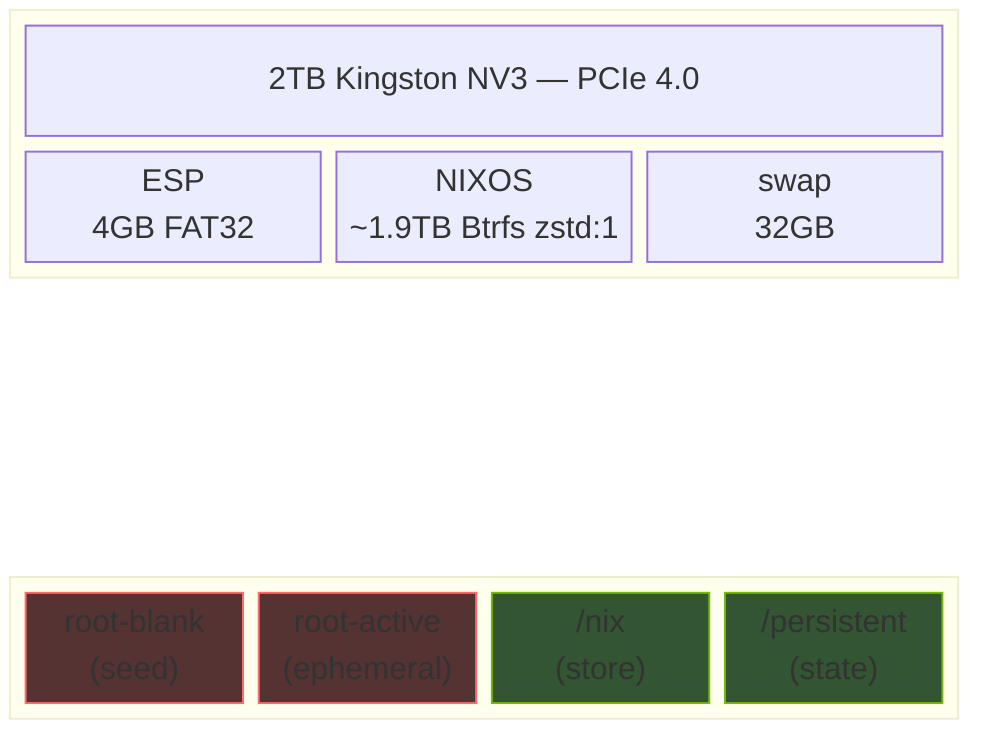

<div align="center">

```
                          ╔══════════════════════════════════════╗
                          ║                                      ║
                          ║   ┏┳┓┏━┓┏┓╻╺┳┓┏━┓┏━┓┏━╸┏━┓┏━┓┏━┓  ║
                          ║   ┃┃┃┣━┫┃┗┫ ┃┃┣┳┛┣━┫┃╺┓┃ ┃┣┳┛┣━┫  ║
                          ║   ╹ ╹╹ ╹╹ ╹╺┻┛╹┗╸╹ ╹┗━┛┗━┛╹┗╸╹ ╹  ║
                          ║                                      ║
                          ║          T H E   S E C O N D         ║
                          ║                S K I N                ║
                          ║                                      ║
                          ╚══════════════════════════════════════╝
```

[](https://nixos.org)
[](https://hyprland.org)
[](https://nvidia.com)
[]()
[]()
[](https://github.com/Mic92/sops-nix)

---

**A declarative NixOS workstation that wipes itself clean on every boot.**

*Reproducible from scratch in under 30 minutes. No imperative state. No drift.*

</div>

---

## Architecture

```
┌─────────────────────────────────────────────────────────────────┐
│  flake.nix                                                      │
│  └── hosts/mandragora-desktop/                                  │
│       ├── hardware-configuration.nix                            │
│       └── default.nix ──┬── modules/core/     System backbone   │
│                         ├── modules/desktop/  Hyprland + gaming │
│                         ├── modules/user/     Home Manager      │
│                         └── modules/audits/   Health checks     │
├─────────────────────────────────────────────────────────────────┤
│  snippets/        Non-Nix logic (shell, Lua, CSS, Python)       │
│  secrets/         Age-encrypted vaults (sops-nix)               │
│  atlas/           Hardware specs, constraints, partition plan    │
│  appendix/        Self-contained subprojects (Ventoy, WSL)      │
└─────────────────────────────────────────────────────────────────┘
```

## Key Principles

| Principle | Implementation |
|:----------|:---------------|
| **Ephemeral root** | Btrfs snapshot rotation wipes `/` on every boot |
| **Declarative everything** | All state is a Nix expression — zero imperative setup |
| **Language purity** | Non-Nix code lives in `snippets/`, referenced via `builtins.readFile` |
| **Zero plaintext secrets** | sops-nix with age encryption, decryption key on persistent volume |
| **Wayland-only** | Hyprland + proprietary NVIDIA 570.x, no X11 fallback |

## Impermanence Lifecycle


## Disk Layout



## What Survives Reboot

```
     ╭──────────────────────────────────────────────────╮
     │            P E R S I S T E N T                    │
     │                                                  │
     │  /nix ··········· packages, store, generations   │
     │  /persistent/home/m ··········· all user data    │
     │  /persistent/secrets ··········· age key         │
     │  /persistent/var/lib ··········· BT, NixOS       │
     │  /persistent/etc ··········· NM, machine-id      │
     ╰──────────────────────────────────────────────────╯

     ╭──────────────────────────────────────────────────╮
     │            E P H E M E R A L                     │
     │                                                  │
     │  / ··········· wiped every boot                  │
     │  /tmp ··········· tmpfs                          │
     │  /run ··········· tmpfs                          │
     ╰──────────────────────────────────────────────────╯
```

## Hardware

```
 CPU     AMD Ryzen 9 7900X          12C / 24T
 GPU     NVIDIA RTX 5070 Ti         16GB GDDR7
 RAM     32GB DDR5                  6000MHz CL30
 Board   Gigabyte B650M AORUS       ELITE AX WiFi
 Cool    MSI MAG Coreliquid A13     360mm AIO ARGB
 PSU     Thermaltake GF A3          850W ATX 3.0
 Drive   Kingston NV3               2TB PCIe 4.0
 Case    Lian Li A3-mATX
```

## Module Map

```
modules/
├── core/
│   ├── globals.nix ............. system packages, nix settings
│   ├── boot.nix ................ systemd-boot, kernel params
│   ├── impermanence.nix ........ root wipe + bind mounts
│   ├── persistence.nix ......... declarative persist paths
│   ├── storage.nix ............. Btrfs mounts, fstab
│   ├── graphics.nix ............ NVIDIA 570.x, Wayland env
│   ├── secrets.nix ............. sops-nix declarations
│   ├── security.nix ............ firewall, hardening
│   ├── ai-local.nix ............ Ollama + CUDA models
│   └── vm.nix .................. QEMU/libvirt
├── desktop/
│   ├── hyprland.nix ............ compositor config
│   ├── openrgb.nix ............. peripheral RGB control
│   ├── steam.nix ............... gaming + Proton
│   ├── seafile.nix ............. file sync client
│   └── keyledsd.nix ............ keyboard LEDs
└── user/
    ├── home-manager.nix ........ HM entry point
    ├── home.nix ................ packages, dotfiles
    ├── zsh.nix ................. shell config
    ├── tmux.nix ................ terminal multiplexer
    ├── waybar.nix .............. status bar
    └── lf.nix .................. file manager
```

## Deploy

```bash
sudo nixos-rebuild switch --flake /etc/nixos/mandragora#mandragora-desktop
```

Or use the integrated workflow:

```bash
mandragora-switch "commit message"
```

This stages all changes, rebuilds, and pushes on success — rolling back the commit on failure.

## Flake Inputs

| Input | Purpose |
|:------|:--------|
| [`nixpkgs`](https://github.com/NixOS/nixpkgs) (unstable) | Package set + NixOS modules |
| [`home-manager`](https://github.com/nix-community/home-manager) | Dotfile management as Nix |
| [`sops-nix`](https://github.com/Mic92/sops-nix) | Declarative secret decryption |
| [`impermanence`](https://github.com/nix-community/impermanence) | Stateless root with opt-in persistence |

## Documentation

| Document | Purpose |
|:---------|:--------|
| [`DECISIONS.md`](DECISIONS.md) | All resolved technical choices |
| [`STRUCTURE.md`](STRUCTURE.md) | Repo layout and module map |
| [`DATA_HIERARCHY.md`](DATA_HIERARCHY.md) | 5-tier persistence/backup matrix |
| [`WORKFLOW.md`](WORKFLOW.md) | Sync ritual and rebuild workflow |
| [`SECRETS.md`](SECRETS.md) | sops-nix vault strategy |
| [`atlas/`](atlas/) | Hardware, constraints, partition plan |

---

<div align="center">

*Built with obsessive declarativity on NixOS unstable.*

</div>
