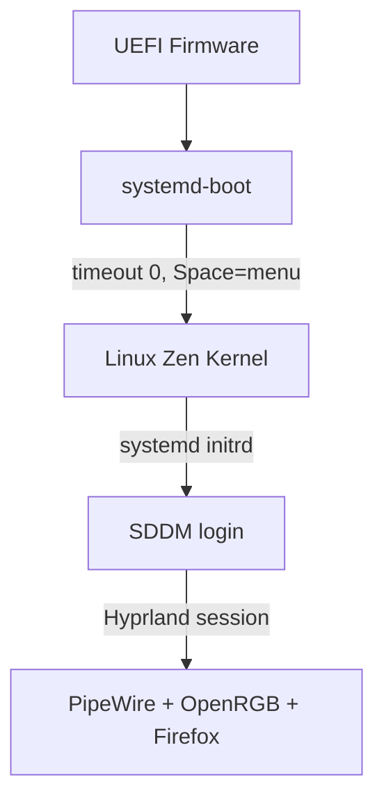
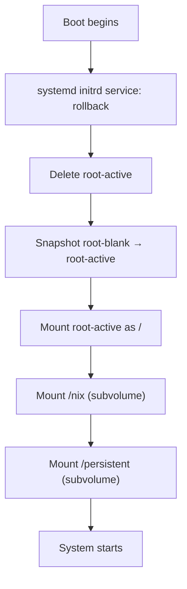
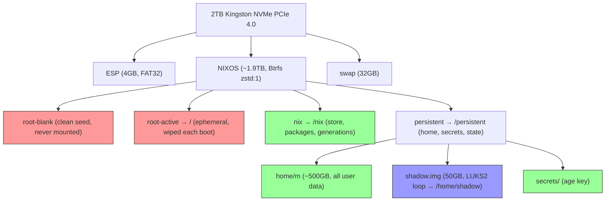
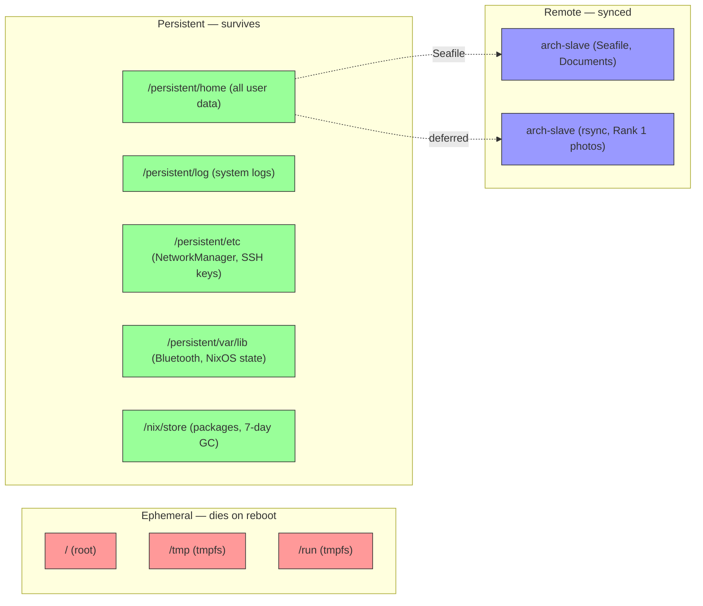

# Mandragora NixOS

A "second skin" Linux workstation — NVIDIA RTX 5070 Ti, Hyprland, impermanent root, and a 2TB NVMe carved into ranked persistence tiers.

---

## Boot Chain

## Impermanence Lifecycle

Every boot rotates the root subvolume and rebuilds from the last successful NixOS generation.

## Disk Layout — Btrfs Subvolume Tree

## Data Persistence Flow

## Quick Reference

| Topic | File |
|-------|------|
| All resolved decisions | [`DECISIONS.md`](DECISIONS.md) |
| Disk partition plan | [`atlas/PARTITION_PLAN.md`](atlas/PARTITION_PLAN.md) |
| Day-to-day situations | [`SITUATIONS.md`](SITUATIONS.md) |
| Build checklist | [`EXECUTION_PLAN.md`](EXECUTION_PLAN.md) |
| Hardware specs | [`atlas/hardware.md`](atlas/hardware.md) |
| Hard constraints | [`atlas/non-negotiables.md`](atlas/non-negotiables.md) |
| Routing for AI sessions | [`AGENTS.md`](AGENTS.md) |
| Secrets strategy | [`SECRETS.md`](SECRETS.md) |
| Hardware assembly status | [`atlas/README.md`](atlas/README.md) |
| Windows/WSL adaptation | [`appendix/wsl/README.md`](appendix/wsl/README.md) |

## Hardware

| Component | Choice |
|-----------|--------|
| CPU | AMD Ryzen 9 7900X (12C/24T) |
| GPU | RTX 5070 Ti (16GB GDDR7) |
| RAM | 32GB DDR5 6000MHz CL30 |
| Motherboard | Gigabyte B650M AORUS ELITE AX WIFI |
| Case | Lian Li A3-mATX |
| Cooler | MSI MAG Coreliquid A13 (360mm ARGB) |
| PSU | Thermaltake Toughpower GF A3 850W (ATX 3.0) |
| Storage | 2TB Kingston NV3 PCIe 4.0 |
